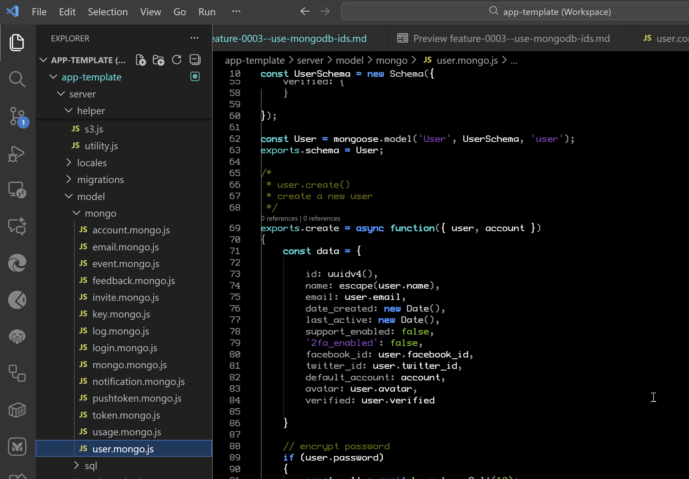

# 😎 feature/0003--use-mongodb-ids (app-template)

| Issue # | PR #    | Requested by | Implemented by  | Date       | Release # |
| ------- | ------- | ------------ | --------------- | ---------- | --------- |
| `#0003` | `#pppp` | MongoDB      | Timothy McGuire | 2025-11-27 | `a0.0.0`  |

- **Source Branch:** `main`
- **Working Branch:** `feature/0003--use-mongodb-ids`
- **Target Branch:** `develop`
- **Tag:** `a0.0.0`

## Request

Summary description of the requested feature or change. Include links to product requirements, customer tickets, or GitHub issues as applicable.

Change all primary keys from Gravity's "id" to MongoDB ObjectIDs "\_id" across the application.

## Current Behavior (AS-IS)

Describe in detail the current behavior, including screenshots, logs, or relevant references.

Kyle's original implementation uses custom random IDs for all entities.
This requires additional logic to manage ID generation and uniqueness.

- **Current UI, Workflow or Code:**

## Requested Behavior (TO-BE)

Describe in detail the desired behavior. Include acceptance criteria, UX/UI mocks, API changes, and any non-functional requirements.

MongoDB recommends using ObjectIDs as primary keys for documents.
Switching to ObjectIDs will simplify the codebase and improve performance.
It will also enhance compatibility with MongoDB features and tools,
and move us to our standard key naming convention, '\_id' and 'parent_id'.

## ID Design Policy (Global)

### 0. Table/Collection Names

- Use **singular** names for all tables/collections.
- SQL tables use the same singular entity name as the MongoDB collection (no `tbl_` prefix), e.g. `user`, `account`.
- MongoDB collections are named without prefixes (e.g. `user`, `account`).

### 1. Primary Keys

- **Canonical name**: Every persisted record has exactly one primary key named `_id`.
- **Table/collection naming**:
  - Tables/collections that hold individual entities use **singular** names.
  - Example: a table of all users is `tbl_user`; each row is one `user` entity.
- **Type by store**:
  - MongoDB: `_id` is a Mongo `ObjectId` in backend memory.
  - SQL (or any other DB): `_id` is still the primary key column name and must be semantically equivalent to a Mongo-style ID (unique, opaque, non-business).
- **Creation**:
  - For Mongo: generated by MongoDB (or standard `ObjectId()` generator), never custom ad hoc logic.
  - For SQL/other stores: generated to preserve the same semantics (opaque, globally unique, non-business).

### 2. Foreign Keys and Relationships

- **Foreign key naming (singular)**:
  - Any reference to another entity uses: `{entity_name}_id`, where `{entity_name}` is singular.
  - Example:
    - Entity table: `tbl_user`
    - Primary key: `_id`
    - Foreign key in another table: `user_id`
- **Join/association tables**:
  - Use one column per referenced entity, each following the same pattern.
  - Example: a `tbl_user_role` table might have `user_id` and `role_id`.
  - If we encounter ambiguous cases (e.g. `user_roles_id`), we will explicitly decide and document them, defaulting to the simple singular rule above.
- **Lists of IDs**:
  - For arrays of references, use `{entity_name}_ids` (plural suffix).
  - Example: `role_ids` as an array of `_id` values referencing `tbl_role`.

### 3. Representation Across Layers

- **Backend (Node/JS)**:
  - `_id` is treated as a Mongo `ObjectId` (or equivalent opaque ID type) in backend code.
- **APIs / JSON / Frontends**:
  - `_id` is serialized as a 24-character hex string (HEX-24).
  - Foreign keys (`{entity}_id`, `{entity}_ids`) are also 24-character hex string(s).
- **Public identifier pattern (external IDs)**:
  - External/public identifiers (API responses, URLs, webhooks, partner integrations) must NOT expose raw internal `_id` values.
  - When an external identifier is needed, define a dedicated public ID field (e.g. `user_ref`, `acct_ref`, or a prefixed code).
  - The mapping from public IDs to internal `_id` remains an internal implementation detail.

### 4. Hard Rules and Prohibitions

- **No alternate primary key names**:
  - Do not use `id`, `userId`, `accountId`, or any variant as the primary key field name.
  - `_id` is the one and only primary key field for every entity.
- **No alternate primary key types**:
  - Do not use numeric auto-increment, UUIDv4, or other schemes as the primary key.
  - Such values may exist as separate, secondary fields (e.g. `account_number`, `uuid`) but never as the canonical primary key or join key.
- **No TypeScript**:
  - This codebase remains JavaScript-only. Do not introduce TypeScript or TS tooling.

### 5. Exposure and Integration

- **Internal vs external IDs**:
  - `_id` and all `{entity}_id` / `{entity}_ids` fields are internal-only implementation details.
  - Public APIs, webhooks, emails, and external-facing logs must use external IDs (e.g. `user_ref`) and never leak raw `_id`.
- **Logging and observability**:
  - Internal logs and metrics may include `_id` values for debugging.
  - If logs are shared externally, they must be scrubbed or reviewed to avoid leaking `_id` values.

### 6. Cross-App Consistency

- **Applies to all apps**:
  - This policy is global across `server`, `admin`, `client`, `portal`, `app`, and any new services or workers.
- **Future enforcement**:
  - All new schemas, migrations, routes, and models must adhere to this policy.
  - Any exception (e.g. due to a legacy or third-party constraint) must be explicitly documented at the point of use.

### 7. External ID Prefix Pattern (Draft)

- **Goal**: Derive short, human-recognizable prefixes for external IDs from the entity/table name.
- **Initial proposal**:
  - Start with the singular entity name (e.g. `user`, `organization`, `invoice`).
  - Take consonants in order until you have 3 characters (padding with vowels if needed).
  - Examples (hypothetical):
    - `user` → `usr_XXXXXXXX`
    - `organization` → `org_XXXXXXXX`
    - `invoice` → `inv_XXXXXXXX`
- **Status**:

  - This is an initial idea and not yet final.
  - Finalization of the external ID prefix scheme will be done before any public APIs, webhooks, or partner integrations are declared stable.

## Reason for Change

MongoDB ObjectIDs are optimized for performance and storage efficiency.
Using them will reduce complexity in our codebase and improve maintainability.

## Implementation Plan

This change will involve updating the data models, database access layers,
and any related business logic to use MongoDB ObjectIDs. I've already down this once to
Kyle's original implementation, in the original LADDERS code, so this will be a reversion to that approach.

- **Repositories / Modules affected:** `server`, `admin`, `client`, `app`, `portal`, `template`, `bin`
- **Dependencies / External systems:** MongoDB, SQL (optional), third-party providers (e.g. Stripe, Mailgun)
- **Database Changes:** Update schemas to use `_id` (Mongo `ObjectId` semantics), `{entity}_id` foreign keys, `{entity}_ref` public refs, and `{provider}_{entity}_ref` external refs. Add a prefix registry table/collection.
- **Testing Plan:** Expanded unit and integration tests enforcing `_id` usage, ref generation, and absence of legacy `id` PKs; generator/template tests.
- **Risks & Mitigations:** Template-only change (no production DBs yet) minimizes risk. Strong test coverage to enforce rules before release.
- **Rollout Plan:** Apply changes in template repos (`server`, `admin`, etc.), ensure all tests pass, then use updated template for new apps.
- **Back-out Plan:** Revert template branches to pre-feature state if design or tests reveal issues.

## Design

### A. Global ID Semantics

- Internal DB IDs:
  - Primary key for all entities: `_id` (Mongo `ObjectId` semantics; SQL as `CHAR(24)` HEX-24).
  - Foreign keys: `{entity}_id` (singular entity name), arrays as `{entity}_ids`.
- External/public IDs (our own):
  - `{entity}_ref` generated when an entity is first published externally.
- External system IDs:
  - `{provider}_{entity}_ref`, e.g. `stripe_customer_ref`, `stripe_subscription_ref`, `mailgun_message_ref`.
  - Never end with `_id`; `_id` is reserved strictly for our DB keys.

### B. Mongo `_id` Schema: Omit vs Explicit Definition

For Mongo collection schemas, we have two options:

1. **Omitting `_id` (let Mongo create it automatically)**

   - Pros:
     - Less boilerplate; relies on Mongo's standard behavior (`_id` is always `ObjectId`).
     - Fewer chances to misconfigure `_id` type or options.
     - Simpler schemas; familiar to Mongo-experienced developers.
   - Cons:
     - Schemas do not explicitly show `_id` type; less self-documenting.
     - Special handling involving `_id` may be less obvious.

2. **Explicitly defining `_id: ObjectId`**
   - Pros:
     - Self-documenting: every top-level schema clearly shows `_id` as `ObjectId`.
     - Reinforces the global policy that `_id` is the canonical PK.
     - Easier to attach schema-level options directly to `_id` when needed.
   - Cons:
     - Slightly more boilerplate; repeated across schemas.
     - Risk of accidental misconfiguration (e.g. changing type away from `ObjectId`).

**Choice for this template:**

- For **top-level collections**, explicitly define `_id: ObjectId` in schemas to make the policy clear.
- For **embedded subdocuments**, omit `_id` unless specifically required, following Mongo best practices.

### C. Prefix Management and Ref System

#### C.1 Entities with `{entity}_ref` in v1

- Initially externally publishable entities (and any future externally visible ones):
  - All entities defined under `server/model/**` that can be exposed outside the system (starting with `account` and any organization-equivalent, then extended as needed).
- Each such externally publishable entity has:
  - `_id` – internal primary key.
  - `{entity}_ref` – external/public reference (e.g. `organization_ref`, `account_ref`).
  - Optional provider refs, e.g. `stripe_customer_ref`, `mailgun_message_ref`.

#### C.2 Ref Generation Lifecycle

- `{entity}_ref` is generated **only when** a record is first published externally (webhook, email, public API, etc.).
- Flow:
  1. Service checks if `{entity}_ref` is present.
  2. If not, it calls `newRef(entityName, _id)` in a ref helper.
  3. The helper:
     - Looks up a prefix for the entity.
     - Creates a token (derived from `_id` or a random source).
     - Returns `{entity}_ref = prefix + "_" + token`.
  4. Service persists `{entity}_ref` on the entity and uses it in external payloads.

#### C.3 Prefix Registry Table/Collection

- New registry to define unique prefixes per entity:
  - Mongo: `prefix_registry` collection.
  - SQL: `tbl_prefix_registry` table.
- Fields:
  - `_id`: internal PK.
  - `entity_name`: singular entity name, e.g. `user`, `organization`, `account`.
  - `prefix`: 3–4 character prefix, minimum of 3 characters, e.g. `usr`, `org`, `acc`.
  - `created_at`, `updated_at`: timestamps.
- Initialization:
  - Setup/seed step iterates known entities and computes an initial prefix by:
    - Taking consonants from the entity name in order until at least 3 characters are collected.
    - Optionally adding vowels for readability or uniqueness.
    - Ensuring uniqueness; resolving collisions by adding more characters or a minimal suffix.
- Usage:
  - `refHelper.entityPrefix(entityName)`:
    - Looks up the prefix in the registry.
    - If missing, computes a new prefix, stores it, and returns it.
  - `refHelper.newRef(entityName, _id)`:
    - Calls `entityPrefix(entityName)`.
    - Builds `{entity}_ref` using `prefix + "_" + token`.

### D. Server Design & Refactor Plan

- **ID Helper Module** (`server/helper/id.js`):
  - `newId()` – returns a new `ObjectId` (or HEX-24 for SQL).
  - `toObjectId(value)` – normalize string/`ObjectId` to `ObjectId`.
  - `toHex(value)` – normalize `ObjectId` to HEX-24 string.
  - `isValidHex(value)` – validate 24-char hex IDs.
- **Ref Helper Module** (`server/helper/ref.js`):
  - `entityPrefix(entityName)` – uses the prefix registry.
  - `newRef(entityName, _id)` – builds `{entity}_ref`.
  - `isValidRef(ref)` – validates ref format.
- **Routes** (`server/api/*.route.js`):
  - Use singular entity names, e.g. `/api/user`, `/api/account`.
  - Use `:_id` and `{entity}_id` exclusively as route params (no `:id`).
  - Validate incoming `_id` with `isValidHex` and convert via `toObjectId`.
- **Controllers** (`server/controller/**/*.js`):
  - Replace any `id` usage with `_id` or `{entity}_id`.
  - Function names may use `Id` (e.g. `getUserById`), but parameters/fields use `_id` / `{entity}_id`.
  - Responses include `_id` and `{entity}_id`/`{entity}_ids`, never bare `id` as PK.
- **Models & Schemas** (`server/model/mongo/**`, `server/model/sql/**`, `server/migrations/**`):
  - Mongo:
    - Explicitly define `_id: ObjectId` on top-level collections.
    - Use `{entity}_id` fields typed as `ObjectId` for references.
  - SQL:
    - Use `_id CHAR(24)` as primary key.
    - Use `{entity}_id CHAR(24)` as foreign keys referencing corresponding `_id`.
    - No `id` columns as primary keys.
- **External Refs in DB**:
  - Add `{entity}_ref` fields for externally publishable entities (initially `organization` / `account`).
  - Add provider-specific refs like `stripe_customer_ref`, `stripe_subscription_ref`, `mailgun_message_ref`.
  - Ensure unique indexes where appropriate for `{entity}_ref`.

### E. Admin / Console Design

- All admin/console code lives under `app-template/admin` (backend and frontend) and may have a `console/` frontend.
- **Backend**:
  - Mirrors server semantics: `_id` and `{entity}_id` everywhere; no `id`.
  - Uses the same ref and ID helpers when interacting with server and external systems.
- **Frontend**:
  - Entity lists and detail pages keyed by `_id`.
  - Routes like `/user/:_id` for admin-only views.
  - Diagnostic views (guarded by ADMIN role) show raw `_id`, `{entity}_ref`, and external `{provider}_{entity}_ref` values.

## Test Plan (Structure and Coverage)

### Server Tests

- **Structure**:
  - `server/test/unit/`
    - `helper/id.test.js` – tests `newId`, `toObjectId`, `toHex`, `isValidHex`.
    - `helper/ref.test.js` – tests prefix lookup/creation and `newRef` format/uniqueness.
    - `model/<entity>.model.test.js` – asserts `_id` presence and type, `{entity}_id` correctness, and absence of bare `id` as PK.
  - `server/test/integration/`
    - `api/user.api.test.js`, `api/account.api.test.js`, etc. – CRUD tests using `/api/user/:_id` and verifying response shapes.
    - Ref publication tests – ensure `{entity}_ref` is created on first external publish and reused thereafter.
  - Optional static tests:
    - `test/unit/static/id-naming.test.js` – scans models/migrations to ensure no disallowed PK names (`id`, `userId`, etc.) and that `_id` is present.

### Admin / Console Tests

- **Unit tests**:
  - Components use `_id` for keys and routing, not `id`.
  - Diagnostic components show `_id` and refs only when ADMIN role is active.
- **Integration / e2e tests**:
  - Admin flows create and edit entities via APIs that use `_id`/`{entity}_id`.
  - Diagnostic views are inaccessible to non-admin users and correctly display internal `_id` and external refs for admins.

### Template / Generator Tests

- **Generator tests** for `template/**` and `bin/**`:

  - Run scaffolding scripts to generate sample resources.
  - Assert generated code:
    - Uses `_id`, `{entity}_id`, `{entity}_ids` for internal IDs.
    - Does not use `id` as primary key or `:id` in routes.
    - Optionally includes `{entity}_ref` fields for externally-visible entities.

## Proposed UI, Workflow or Code:

